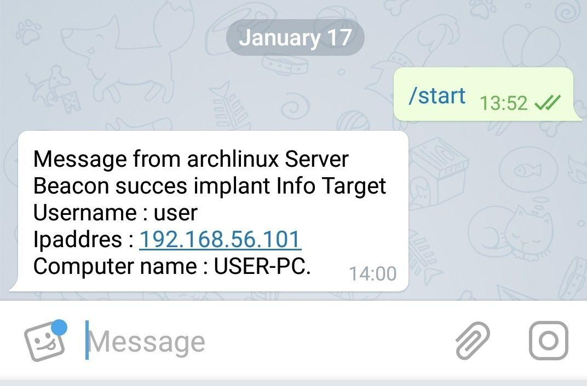
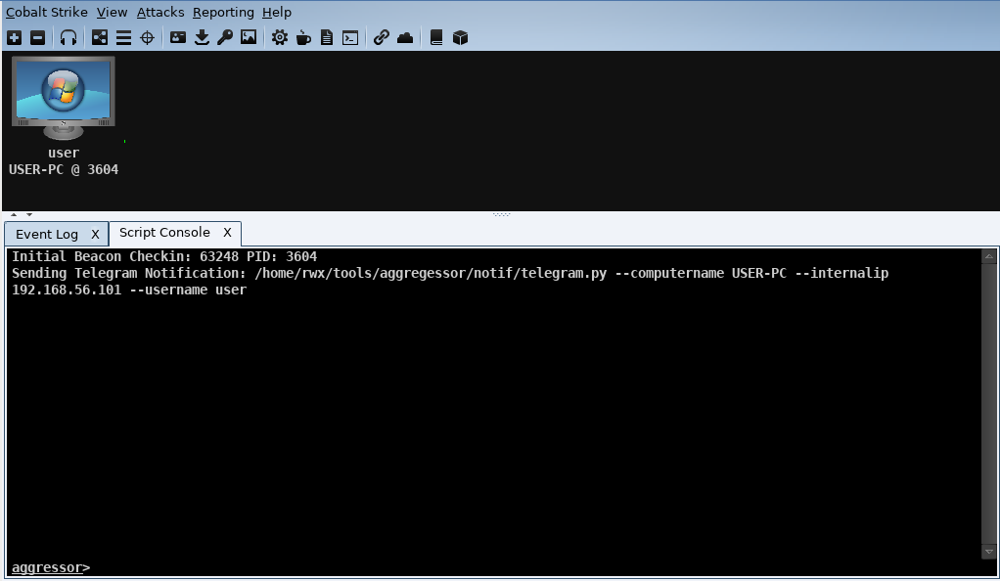

# Red Team Architecture

 

### Telegram Baecon Notif

* change chat_id and  telegram token in telegram.py

		chat_id = 'xxx' #userID

		bot = telepot.Bot('xxxxxxxx') #token telegram

* change location telegram.py in script .cna

	    $cmd = '/home/rwx/tools/aggregessor/notif/telegram.py --computername ' . $computerName . " --internalip " . $internalIP . " --username " . $userName;
	       
	      
	 
* Telegram notif example
{:height="420px" width="410px" align="center"}.

* Aggressor log example

{:height="620px" width="810px" align="center"}.

&copy; [Rahmat Wahyu Hadi](https://github.com/wahyuhadi) - 2019

